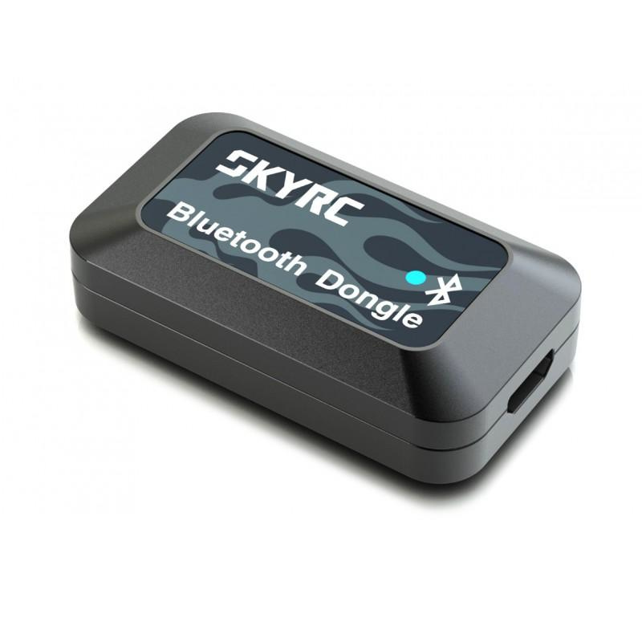

# libskyrc-bt

`libskyrc-bt` is a C shared library for communicating with SkyRC smart chargers over Bluetooth Low Energy on Linux. It provides BlueZ-based device discovery and GATT operations, along with reusable helpers for decoding charger notification frames and splitting firmware images into 20-byte writes.



> **Testing status:** This project has not been tested yet.

## Features

- Scan for nearby BLE devices and read their address, advertised name, and RSSI.
- Connect to a device through BlueZ and read or write GATT characteristics.
- Subscribe to characteristic notifications and dispatch them with `skyrc_bt_poll()`.
- Decode notification frames incrementally, including frames split across notifications; configure framing details and ignored commands in the calling application.
- Calculate and copy 20-byte firmware image chunks.

Service and characteristic UUIDs are supplied by the caller. The library does not select charger-specific UUIDs or define a complete charger command set.

## Requirements

- Linux with BlueZ and a powered Bluetooth adapter.
- GLib's GIO development files (`gio-2.0`), CMake 3.15 or newer, Ninja, and a C23-capable compiler.
- Permission to access the system D-Bus and Bluetooth adapter.

## Build

The build script configures and builds the shared library with CMake and Ninja:

```sh
./build.sh
```

The resulting library is written to `bin/` (the versioned shared library is named `libskyrc-bt.so`). To configure and build manually:

```sh
cmake -G Ninja -S . -B build
cmake --build build
```

The build also creates the `skyrc-bt` command-line tool in `bin/`. It exposes the
library's device and helper operations:

```sh
skyrc-bt scan [--adapter hci0] [--duration MS]
skyrc-bt connect <address> [--adapter hci0] [--timeout MS]
skyrc-bt read <address> <service-uuid> <characteristic-uuid> [connection options]
skyrc-bt write <address> <service-uuid> <characteristic-uuid> <hex-bytes> [connection options] [--command]
skyrc-bt notify <address> <service-uuid> <characteristic-uuid> [--duration MS] [connection options]
skyrc-bt decode <header-hex> <header-len> <command-offset> <length-offset> <length-adjust> <tail-len> <max-frame> <hex-bytes>
skyrc-bt chunk-count <image-file>
skyrc-bt chunk <image-file> <index>
```

`notify` prints raw notification bytes. `decode` passes a hex byte string through
the incremental frame decoder and prints each complete frame's command and
payload. Firmware chunk commands operate on files and report 20-byte chunk
contents in hexadecimal. Writes use GATT write requests by default; `--command`
selects a write without response.

## Using the library

Include `skyrc-bt.h` and link your program against `libskyrc-bt` and GIO. The public interface is declared in [`include/skyrc-bt.h`](include/skyrc-bt.h).

Typical BLE use follows this sequence:

1. Call `skyrc_bt_scan()` to discover devices. The scan callback can use `skyrc_bt_scan_result_get_address()`, `skyrc_bt_scan_result_get_name()`, and `skyrc_bt_scan_result_get_rssi()`; result values are only valid during the callback.
2. Connect with `skyrc_bt_connect()`, passing the selected address and a positive timeout. Pass `NULL` for the adapter to use a powered adapter automatically, or specify a name such as `hci0`.
3. Use `skyrc_bt_gatt_read()`, `skyrc_bt_gatt_write()`, and optionally `skyrc_bt_notify_start()` with the service and characteristic UUIDs required by your device. UUIDs can be given in 16-bit, 32-bit, or full 128-bit form.
4. Call `skyrc_bt_poll()` to dispatch notification callbacks, then call `skyrc_bt_disconnect()` to release the connection.

The notification decoder is independent of BlueZ. Create an opaque `skyrc_bt_protocol_config` with `skyrc_bt_protocol_config_create()`, passing the frame header, length byte and adjustment, command offset, header and tail sizes, ignored commands, and maximum frame size. The configuration copies the ignored command bytes. Pass it to `skyrc_bt_decoder_create()`, then free the configuration with `skyrc_bt_protocol_config_free()` when it is no longer needed. Feed incoming bytes to `skyrc_bt_decoder_feed()`; it buffers incomplete frames and invokes the callback for each complete frame that is not configured to be ignored. Free the decoder with `skyrc_bt_decoder_free()` when finished.

Use `skyrc_bt_upgrade_chunk_count()` and `skyrc_bt_upgrade_get_chunk()` to iterate through an image in 20-byte pieces. The final chunk may be shorter. These helpers only divide bytes; the application is responsible for the device-specific update protocol.

## Error handling

Operations return values from `enum skyrc_bt_error`, including invalid arguments/configuration, device-not-found, timeout, D-Bus failure, disconnected-device, malformed-frame, and insufficient-buffer errors. Check return values before using output handles or buffers. `skyrc_bt_gatt_read()` reports the required value length through `value_length`; it returns `SKYRC_BT_BUFFER_TOO_SMALL` if the supplied capacity is insufficient.
